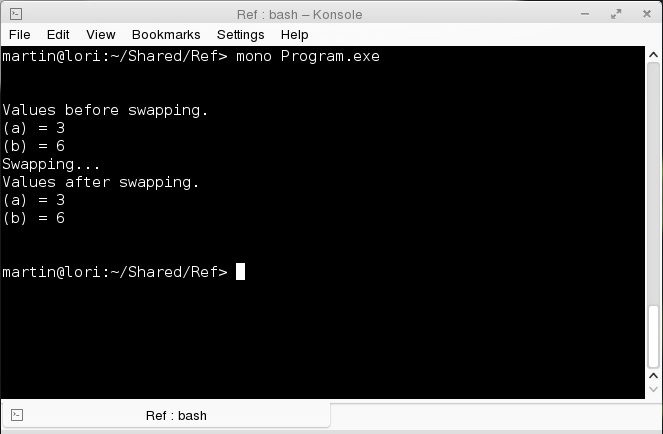
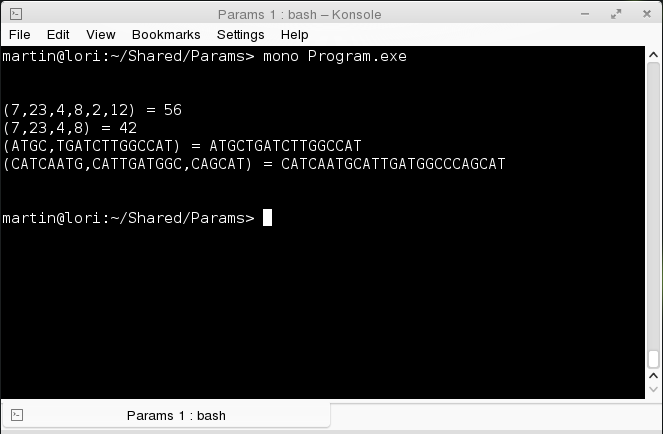
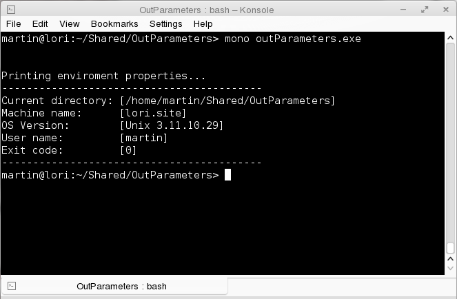

# Entendiendo el paso de variables a métodos en C# con ref, params y out.
		

En C# existen dos formas de pasar variables como parámetros a un método: por valor (Passing by value) que es la forma predeterminada y por referencia (Passing by reference, Passing by address). La definición del parámetro de un método consiste en el tipo de dato, el nombre del parámetro y si son más de uno se separan por coma como en los siguientes códigos:

<pre>
		int method(string p)
		int method(string p, int q, bool r, float t);
</pre>
 <h2>Paso por valor (Passing by value)</h2>

Esta es la forma predeterminada en la que los métodos reciben los parámetros. Esto quiere decir que cuando un parámetro se recibe dentro del método, se crea una copia temporal de los datos, esta copia temporal actúa como una variable dentro del método con la que se realizan operaciones, sin afectar la variable original  y una vez que el método termina su ejecución, la copia temporal es destruida, por lo tanto los cambios en el parámetro no afectan el valor de la variable original.

	  

Este programa intercambia el valor de unos enteros en donde se inicialmente se les asigna un valor, esos enteros después pasan como parámetros, se ejecuta el método y las variables conservan su valor inicial. Aquí muestro la siguiente salida:

	  

	  
	  
 
 <h2>Paso por referencia (Passing by reference)</h2>
	  

	  Hay 3 modificadores de parámetros en C# que sirven para pasar por referencia una variable a un método y estos son:
 
	  <ol>
	  <li><b>ref</b></li>
	  <li><b>out</b></li>
	  <li><b>params</b></li>
	  </ol>
	  <h2>Utilizando ref </h2>
 
Cuando se pasan las variables como parámetros por referencia, el parámetro es en realidad una referencia a la dirección de memoria de la variable que se recibe, por lo que los cambios hechos al parámetro afectan a la variable original. Para pasar un parámetro por referencia, se antepone a la definición del parámetro la palabra reservada <strong>ref</strong>.
	  Para ilustrar este concepto utilizo el programa del ejemplo anterior que intercambia dos valores enteros, pero con la modificación de pasar las variables por referencia (con <strong>ref</strong>) al método no por valor.

 
Al ejecutar este programa se produce el intercambio de variables que realiza el método <i>swap</i>, porque ya no trabaja con copias locales sino con las variables globales. 

	  

	  
	  
 
	  
Aquí el método <i>swap</i> con el modificador <strong>ref</strong> usado en la declaración de variables del método.

	  <pre>
	  static void Swap(ref int number1, ref int number2)
		  {
		  int temp = number1;
		  number1 = number2;
		  number2 = temp;
		  }
	  </pre>
	  
También se debe utilizar el modificador con sus argumentos al invocarlo.

	  <pre>
	  Swap(ref a, ref b);
	  </pre>
 <h2>Utilizando params</h2>
	  
En los ejemplos anteriores el número de parámetros está fijo en la declaración del método. 
	  Sin embargo, C# soporta el uso de un arreglo de parámetros (parameters array), la palabra reservada <strong>params</strong>  permite pasar cualquier número variable de parámetros hacia un método sin necesidad de declararlos como un arreglo. Esta instrucción solo se requiere en la declaración del método. 
	  Con el siguiente programa muestro el uso de params  para calcular el promedio de un arreglo de números y para armar una cadena.

	  
Este programa produce la siguiente salida.

	  

	  
	  
 
 <h2>Utilizando output parameters</h2>
	  
Un método de forma predeterminada solo puede devolver un valor mediante la instrucción <strong>return</strong>, al menos que se utilicen los output parameters (parámetros de salida), con esta característica pueden devolver tantos valores de salida como parámetros de salida tengan, no es necesario asignar valores a esos parámetros afuera del método sino se debe asignar el valor dentro del método que los va a utilizar o de lo contrario el compilador marcara un error. 

	  
Para utilizar los output parameters se debe anteponer la palabra reservada: <strong>out</strong> en la declaración de cada parámetro:

	  <pre>
	  
	  static void SetEnviromentProperties(out string currentDirectory,
		  out string machineName,
		  out string osVersion,
		  out string userName,
		  out int exitCode)
	  </pre>
	  
Bien con el siguiente programa mostraré el uso de esta característica.

	  
Al ejecutar el programa, se vera la siguiente salida:

	  

	  
	  
 
	  
Al ejecutarse el método <i>SetEnviromentProperties</i> sus correspondientes argumentos también deben tener la palabra reservada <b>out</b>, para que dentro del método se les asigne el valor correspondiente.

	  <pre>
	  
	  static void SetEnviromentProperties(out string currentDirectory,
		  out string machineName,
		  out string osVersion,
		  out string userName,
		  out int exitCode)
	  
	  </pre>

Finalmente hay que recordar que un método que define output parameters DEBE asignar un valor a los parámetros <strong>out</strong> antes de que el método termine de ejecutarse, de lo contrario el compilador marcara un error.

	  

